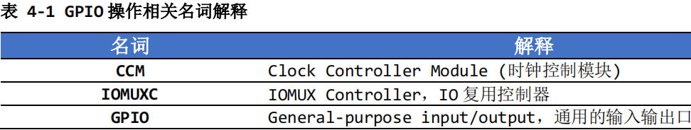
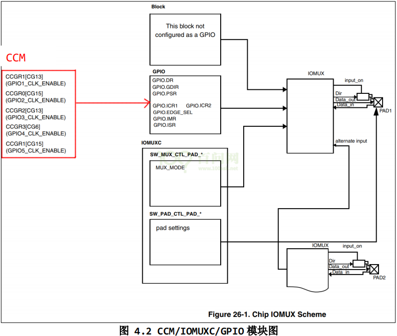

<!--
 * @Author: Clark
 * @Email: haixuanwoTxh@gmail.com
 * @Date: 2025-12-18 16:02:13
 * @LastEditors: Clark
 * @LastEditTime: 2025-12-18 21:43:27
 * @Description: file content
-->

# 设备树

## 内核源码目录
Linux-4.9.88/arch/arm/boot/dts/100ask_imx6ull-14x14.dts
/boot/arch/arm/boot/dts/imx6ull-14x14-alpha.dtb
Linux-4.9.88/Documentation/devicetree/bindings

## 设备中目录
/sys/firmware/devicetree/base/leds

/boot/100ask_imx6ull-14x14.dtb
/boot/100ask_imx6ull_mini.dtb
/boot/100ask_myir_imx6ull_mini.dtb
/boot/zImage

cd /sys/firmware/devicetree/base/
/sys/devices/platform
/sys/bus/platform/drivers

vim arch/arm/boot/dts/100ask_imx6ull-14x14.dts

#define GROUP_PIN(g,p) ((g<<16) | (p))

/ {
	100ask_led@0 {
		compatible = "100as,leddrv";
		pin = <GROUP_PIN(5, 3)>;
	};

make dtbs
arch/arm/boot/dts/100ask_imx6ull-14x14.dtb

设备中：cp arch/arm/boot/dts/100ask_imx6ull-14x14.dtb /boot

